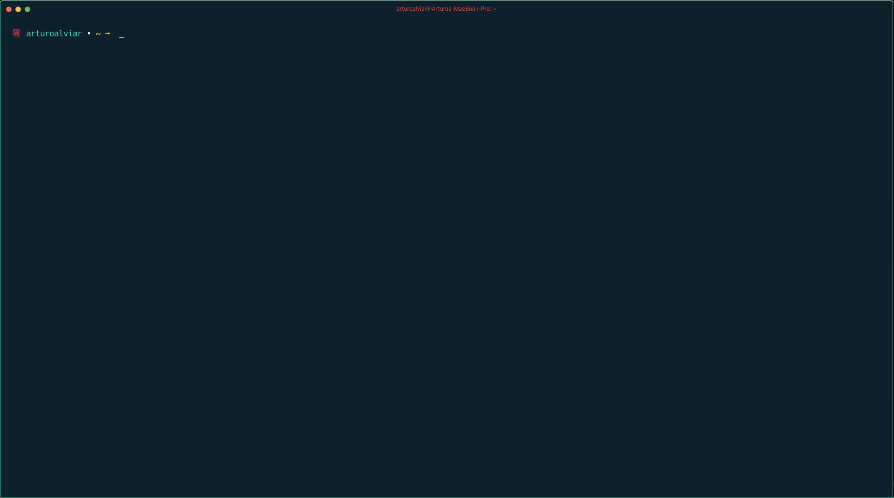

# Rei ZSH theme
Rei is a simple theme with the first character being 零(rei), the number 0.

---

## Screenshot

---

## Installation
Copy the rei.zsh-theme file into your local oh-my-zsh/themes folder (usually found in your home directory ~/.oh-my-zsh/). Then set you ZSH_THEME to the name of the desired theme in the rei.zshrc file.

---

## License
The MIT License.
